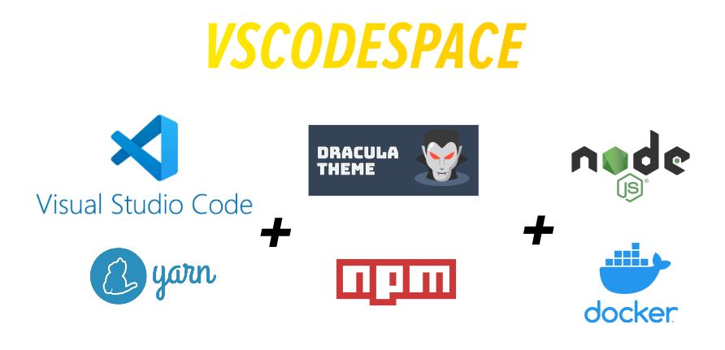

# vscodespace for Windows

  <b>You need to have a workspace for Visual Studio Code!</b>
  

## Requirements

* [Vagrant 2.2 - Download Here](https://releases.hashicorp.com/vagrant/2.2.9/vagrant_2.2.9_x86_64.msi)
* [Git for Windows 2.26 - Download Here](https://github.com/git-for-windows/git/releases/download/v2.26.2.windows.1/Git-2.26.2-64-bit.exe)
* [VirtualBox 6.0.10 - Download Here](https://download.virtualbox.org/virtualbox/6.0.10/VirtualBox-6.0.10-132072-Win.exe)
* [FiraCode Font - Download Here](https://github.com/tonsky/FiraCode/releases/download/4/Fira_Code_v4.zip)
* [Visual Studio Code](https://code.visualstudio.com/)

## Download

Please, download [Vscodespace.Setup_win64.msi](https://github.com/cristiancmello/vscodespace/releases/download/1.0.5/Vscodespace.Setup_win64.msi).

## Instructions

### 1. Installing Vscodespace

### 2. Build and Start

### 3. Open Your Workspace in Visual Studio Code

### 4. Installing Popular Extensions

### 5. Node, Yarn, NPM, Docker and Docker Compose installed

### 6. Exposing Web App

